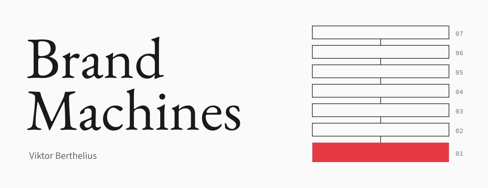
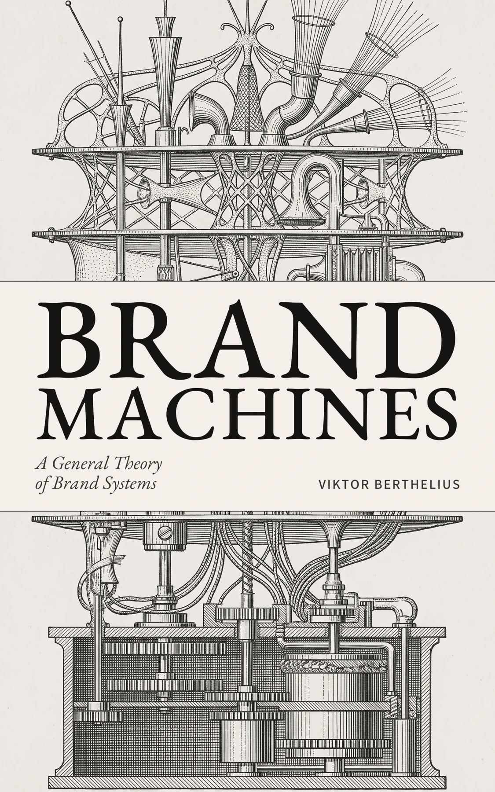

<p align="right"><strong>English</strong> · <a href="README.es.md" lang="es">Español</a></p>

<p align="center">
  
</p>

<h1 align="center">A brand lives in its decisions.</h1>

<p align="center">
  The method from the book, made available to your agents.<br>
  <sub>Diagnose identity. Generate proposals. Review coherence.</sub>
</p>

<p align="center">
  <a href="#install"><strong>Install the skill</strong></a> &nbsp;·&nbsp;
  <a href="#the-method">The method</a> &nbsp;·&nbsp;
  <a href="#patagonia">Patagonia</a> &nbsp;·&nbsp;
  <a href="#the-book">The book</a>
</p>

<p align="center">
  <a href="https://skills.sh/berthelius/brand-machines-agents/brand-machines"></a>
  <a href="https://github.com/berthelius/brand-machines-agents/actions/workflows/verify.yml"></a>
  <a href="LICENSE"></a>
</p>

<br>

A brand reveals its identity in what it chooses, what it refuses and what it is willing to sacrifice. Its principles must remain useful when the brief changes.

**Brand Machines** brings Viktor Berthelius’s method into the work of an agent. Give it a brand’s documents and a task: it can examine the identity, formulate proposals and review decisions against their principles and sources. The method is shared. **Each brand’s identity is its own.**

## Install

From the project where you want to use the skill:

```sh
npx skills add berthelius/brand-machines-agents --skill brand-machines
```

<p><strong>Codex</strong> &nbsp;<code>$brand-machines</code> &nbsp;·&nbsp; <strong>Claude Code</strong> &nbsp;<code>/brand-machines</code></p>

Installation verified in both. Choose the agent and scope in the installer, then give it a brief:

> Apply Brand Machines to this brief and our brand documents. Propose three different directions, explain the principle and trade-off behind each, and review their coherence. Separate evidence, inferences and decisions that still need approval.

<details>
<summary>Manual installation and other agents</summary>

Download the repository or [release](https://github.com/berthelius/brand-machines-agents/releases/tag/v0.2.0). Copy the complete `skills/brand-machines` folder—or `brand-machines` from the ZIP—to your agent's skills directory. Keep `references`, `scripts`, `assets` and `agents` alongside `SKILL.md`.

The documentation works with any agent able to read these files; automatic discovery depends on the environment. Python 3.10 or later is needed only for the optional local checker, which has no external dependencies.

The agent responds in your language. For the local checker, use `--language en` or `--language es`: it selects that language's identity and rules. Existing commands without a flag still use the Spanish pack. With `--pack`, the pack's language governs.

</details>

<br>

## The method

Seven connected layers, from the principles that define an identity to its contact with the world.

| | Layer | What the agent examines |
| :--- | :--- | :--- |
| 01 | **Core** | Purpose, actionable values and vision. |
| 02 | **Mind** | Distributed intelligence and decision principles. |
| 03 | **Body** | The modular architecture that structures expression. |
| 04 | **Skin** | Visual, verbal, sonic and tactile expression. |
| 05 | **Engines** | Generative systems that produce brand output. |
| 06 | **Brand OS** | Workflows and integrations that orchestrate the layers. |
| 07 | **Interconnections** | Points of contact with external ecosystems. |

A decision in one layer has consequences for the others. The agent follows those relationships, distinguishes expressive variation from contradiction, and records what the available evidence cannot establish.

**Diagnose** to understand the system. **Propose** to turn principles into alternatives. **Review** to examine an output and suggest a correction. [Read the method →](skills/brand-machines/references/en/method.md)

<br>

## Patagonia

### One jacket. Two coherent decisions.

Repair a jacket that can still serve its purpose. Consider replacement when the necessary use cannot be restored. The same principle can support both decisions; the context matters.

The worked case puts that distinction beside three other messages, including an environmental absolute and a repair promise that its citation does not support.

<p>
  <strong>4 primary sources &nbsp;·&nbsp; 5 hypothetical situations</strong><br>
  <sub>A source pack, recorded local checks, an annotated semantic review and proposed corrections.</sub>
</p>

**[Read the Patagonia case →](skills/brand-machines/assets/case-studies/patagonia/README.md)**

Independent educational study, without Patagonia’s endorsement. The same assistant prepared the cases and annotations; this is not an independent model evaluation. Four undocumented layers remain explicitly unknown.

<details>
<summary>Reproduce the local checks</summary>

After cloning this repository, run from its root:

```sh
python3 skills/brand-machines/assets/case-studies/patagonia/run.py
```

Python 3.10+, no external dependencies or model calls. The script reproduces mechanical checks; the [annotated review](skills/brand-machines/assets/case-studies/patagonia/semantic-review.md) contains the separate semantic judgments. Exit 0 means the example’s assertions passed, not that its messages are approved.

</details>

<br>

## The local Guardian

The skill gives the agent a method for judgment. The optional Python checker verifies pack structure, source integrity and explicit rules. **Passing those checks leaves semantic review pending.** The included reference identities describe Brand Machines; their style and sources are not imposed on other brands.

<details>
<summary>Try the Chapter 17 example</summary>

After cloning the repository, run from its root:

```sh
python3 skills/brand-machines/scripts/bm.py review --language en \
  --input skills/brand-machines/assets/examples/en/chapter-17.json
```

**Piece:** “The BEST offer of the year!!!!”

**Result:** `revise`, with `no_superlativos` and `exclamaciones_excesivas`, their sources and suggested revisions. Exit code 1 is expected. Rule IDs are shared across languages, as in the book.

</details>

<details>
<summary>Validate a pack, diagnose and try a variation</summary>

```sh
python3 skills/brand-machines/scripts/bm.py validate --language en
python3 skills/brand-machines/scripts/bm.py diagnose --language en
python3 skills/brand-machines/scripts/bm.py review --language en \
  --input skills/brand-machines/assets/examples/en/variation.json
```

The variation returns `needs_review`. `assets/examples/en/semantic-contradiction.json` shows why: a decision can pass lexical checks while contradicting the definition of Brand Machine.

`review`, `diagnose`, `validate` and `serve` accept `--pack path/to/brand.json` to use another identity. Select the right language explicitly; the checker does not detect or translate input. For mixed-language material, review each language with its corresponding pack.

</details>

<details>
<summary>Local API · no keys or model calls</summary>

```sh
python3 skills/brand-machines/scripts/bm.py serve --language en
```

In another terminal:

```sh
curl http://127.0.0.1:8765/api/v1/validate \
  -H 'Content-Type: application/json' \
  --data '{"type":"copy","language":"en","content":"The BEST offer of the year!!!!","context":"email_subject"}'
```

The API runs the same checker and listens only on your machine, using the pack selected at startup for all requests. It needs no keys, makes no model calls and publishes nothing. It is not a hosted public service.

</details>

<details>
<summary>What each check establishes</summary>

| Part | Establishes | Does not establish |
| :--- | :--- | :--- |
| `validate` | Pack structure and source integrity | Truth of the sources |
| `diagnose` | Documentation coverage by layer | Brand maturity |
| `review` / API | Declared checks and presence/expiry of references | Complete semantic coherence or truth of claims |
| Skill applied by an agent | A reasoned review within available scope and sources | Automatic permission to publish |

</details>

<br>

## The book

<p align="center">
  <a href="https://machines.brthls.com/en/#book"></a>
</p>

<p align="center">
  <strong>Brand Machines</strong><br>
  <em>A General Theory of Brand Systems</em><br>
  Viktor Berthelius
</p>

The book develops the argument: identity as a generative system, coherence through principles, and the architecture that makes both possible. This repository adapts part of that method for agents. You can use the skill without buying the book.

<p align="center">
  <a href="https://machines.brthls.com/en/#book"><strong>Explore the book →</strong></a> &nbsp;·&nbsp;
  <a href="https://machines.brthls.com/en/">The project</a> &nbsp;·&nbsp;
  <a href="https://github.com/berthelius">The author</a>
</p>

<br>

## References and development

| Reference | Start here for… |
| :--- | :--- |
| [Method](skills/brand-machines/references/en/method.md) | The seven layers and their relationships. |
| [Workflows](skills/brand-machines/references/en/workflows.md) | Diagnosis, proposal and review. |
| [Guardian contract](skills/brand-machines/references/en/review.md) | Findings, sources and scope of judgment. |
| [Pack format](skills/brand-machines/references/en/pack.md) | Your own brand’s identity and evidence. |
| [Editorial provenance](skills/brand-machines/references/provenance.json) | Sources and the book’s English terminology. |
| [Contributing](CONTRIBUTING.md) | Sourced cases, fixes and language improvements. |

<details>
<summary>Tests and release status</summary>

```sh
python3 -m unittest discover -s tests -v
python3 skills/brand-machines/assets/case-studies/patagonia/run.py
```

CI runs on Python 3.10, 3.12 and 3.14. The tests cover local code, language boundaries and mechanical examples; they do not establish model accuracy or semantic correctness. [View CI](https://github.com/berthelius/brand-machines-agents/actions/workflows/verify.yml).

The latest tagged release is [v0.2.0](https://github.com/berthelius/brand-machines-agents/releases/tag/v0.2.0). The current source tree also includes the Patagonia case, stricter source-expiry validation and this presentation. Those additions are not in the v0.2.0 archive.

</details>

---

<p align="center">
  <sub>A method by <a href="https://www.brthls.com/en/">Viktor Berthelius</a>. Built to be read, used and questioned.</sub><br>
  <sub>MIT for this distribution’s original files. The full manuscript is not included. No rights to third-party brands are granted.</sub>
</p>
